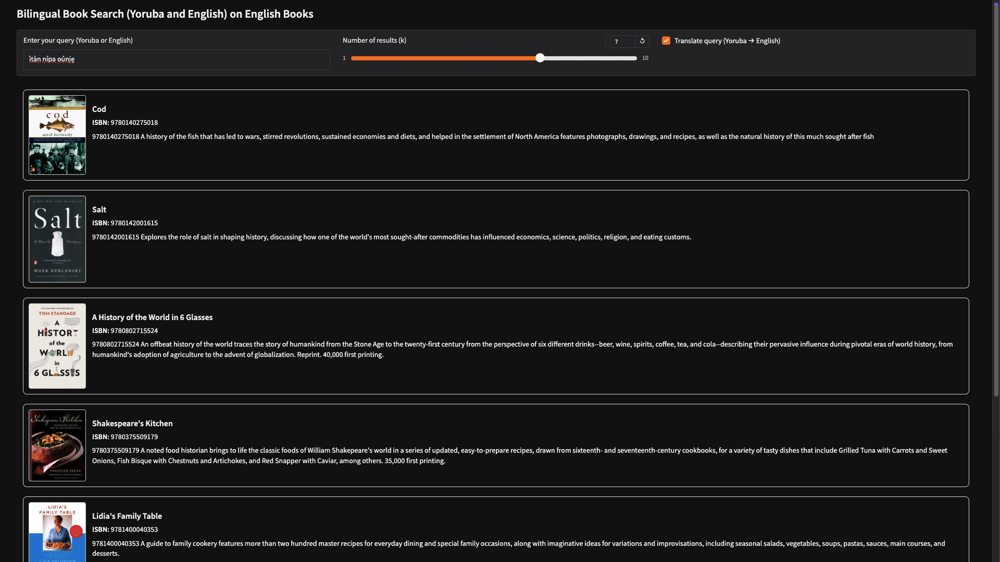

# Bilingual Search Semantic Book Recommender

A simple web app to search English-language books using queries in Yoruba (a low-resource language) or English. 
Built using Python, LangChain, Chroma, and Gradio, this project demonstrates a cross-lingual semantic search workflow.

## Demo
*Search results display the book title, ISBN, description, and cover image.*

  

## Features

- Enter a query in **Yoruba or English**.  
- Optional Yoruba → English translation for seamless search.  
- Returns the top-`k` most relevant English books.  
- Displays **book title, ISBN, description, and cover image**.  
- Built on **vector embeddings** for semantic search.

## Installation

1. Clone the repository

```bash
git clone https://github.com/Olubusolami-R/semantic-book-recommender.git
cd semantic-book-recommender
```

2. Create a virtual environment

```bash
python -m venv .venv
source .venv/bin/activate   # macOS/Linux
.venv\Scripts\activate      # Windows
```

3. Install dependencies
```bash
pip install -r requirements.txt
```

4. Create a .env file with your OpenAI API and HUGGINGFACE HUB API key:
```bash
OPENAI_API_KEY=******
HUGGINGFACEHUB_API_TOKEN=*****
```

## Project Structure
```
book-recommender/
│
├── app.py                     # main entry point to run the UI
├── requirements.txt
├── README.md
│
├── data/
│   └── books_cleaned.csv      # cleaned book dataset
│
├── notebooks/
│   └── data_exploration.ipynb  # dataset exploration & cleaning
│
├── internal/                  # core modules
│   ├── embeddings.py          # build/load vector embeddings
│   ├── search.py              # vector similarity search
│   ├── translate.py           # Yoruba → English translation
│   └── gradio_ui.py           # defines the Gradio interface
```

## Usage

After following the steps above (including ensuring the virtual environment is activated), run:
```bash
python3 app.py
```

Then:
1. Open the Gradio UI in your browser through the url shown on your terminal. 
2. Enter a query in Yoruba or English. 
3. Adjust k (number of results) and optionally translate Yoruba queries. 
4. See your top matching books with title, ISBN, description, and cover image.

## Why This Project?

Many multiligual/bilingual speakers may want to discover books in English without needing to phrase queries in perfect English.
This project allows cross-lingual semantic search and demonstrates a simple semantic search pipeline (Yoruba and English) that can be extended to other languages or domains.

## Future Improvements
1. Add more languages: Going from bilingual to multilingual. 
2. Add a language detection feature that automatically translates non-english text without needing to check a box. 
3. Enhance UI with better styling and pagination.